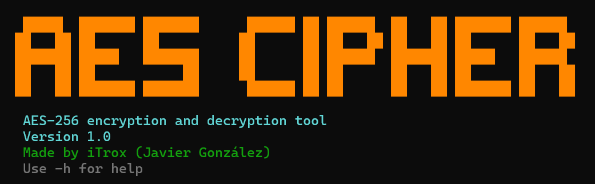
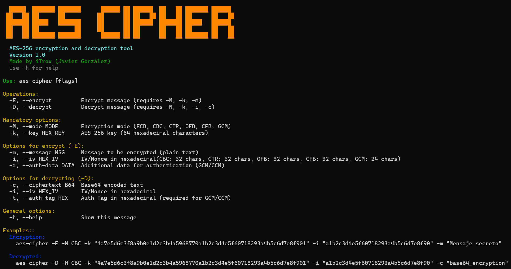

# AES Cipher

<div align="center">
  
</div>

CLI tool written in Ruby that allows you to encrypt and decrypt texts using AES256 encryption under ECB, CBC, CTR, OFB/CFB, and GCM methods.

---

## Install tool

* Download the script to your system

```shell
mkdir -p ~/iTools/AESCipher/ && cd $_
curl -O https://raw.githubusercontent.com/iTroxB/My-scripts/refs/heads/main/AES-Cipher/aesCipher.rb
```

* Create symbolic link to the script

```shell
sudo ln -s ~/iTools/AESCipher/aesCipher.rb /usr/bin/aesCipher
```

* To know the options and parameters of the tool run the help menu with the flag `-h`

```shell
aesCipher -h
```

<div align="center">
  
</div>

---

## Use tool

### ECB

#### Encryption (without IV)

```shell
ruby aesCipher.rb -E -M ECB -k "4a7e5d6c3f8a9b0e1d2c3b4a5968770a1b2c3d4e5f60718293a4b5c6d7e8f901" -m "Mensaje secreto ECB"

  █████  ███████ ███████      ██████ ██    ██ ██████  ██   ██ ███████ ██████
 ██   ██ ██      ██          ██       ██  ██  ██   ██ ██   ██ ██      ██   ██
 ███████ █████   ███████     ██        ████   ██████  ███████ █████   ██████
 ██   ██ ██           ██     ██         ██    ██      ██   ██ ██      ██   ██
 ██   ██ ███████ ███████      ██████    ██    ██      ██   ██ ███████ ██   ██
 
  AES-256 encryption and decryption tool
  Version 1.0
  Made by iTrox (Javier González)
  Use -h for help


[✔] AES-256 encryption result ECB:
➜ Original message: Mensaje secreto ECB
➜ Key used (hex): 4a7e5d6c3f8a9b0e1d2c3b4a5968770a1b2c3d4e5f60718293a4b5c6d7e8f901
➜ IV/Nonce used (hex): N/A
➜ Ciphertext (hex): d8eac7b253046fd9970ec7710b135feb3d1a4806d2c31668b7265af8e3c1ddf21c8d71ab6abf2cbcb8076e37840431b0
➜ Ciphertext (Base64): 2OrHslMEb9mXDsdxCxNf6z0aSAbSwxZotyZa+OPB3fIcjXGrar8svLgHbjeEBDGw
```

#### Decrypted

```shell
ruby aesCipher.rb -D -M ECB -k "4a7e5d6c3f8a9b0e1d2c3b4a5968770a1b2c3d4e5f60718293a4b5c6d7e8f901" -c "2OrHslMEb9mXDsdxCxNf6z0aSAbSwxZotyZa+OPB3fIcjXGrar8svLgHbjeEBDGw"

  █████  ███████ ███████      ██████ ██    ██ ██████  ██   ██ ███████ ██████
 ██   ██ ██      ██          ██       ██  ██  ██   ██ ██   ██ ██      ██   ██
 ███████ █████   ███████     ██        ████   ██████  ███████ █████   ██████
 ██   ██ ██           ██     ██         ██    ██      ██   ██ ██      ██   ██
 ██   ██ ███████ ███████      ██████    ██    ██      ██   ██ ███████ ██   ██
 
  AES-256 encryption and decryption tool
  Version 1.0
  Made by iTrox (Javier González)
  Use -h for help


[✔] AES-256 decryption result-ECB:
➜ Key used (hex): 4a7e5d6c3f8a9b0e1d2c3b4a5968770a1b2c3d4e5f60718293a4b5c6d7e8f901
➜ IV/Nonce used (hex): N/A
➜ Decrypted message: Mensaje secreto ECB
```

---
### CBC

#### Encryption (with IV)

```shell
ruby aesCipher.rb -E -M CBC -k "4a7e5d6c3f8a9b0e1d2c3b4a5968770a1b2c3d4e5f60718293a4b5c6d7e8f901" -i "a1b2c3d4e5f60718293a4b5c6d7e8f90" -m "Mensaje CBC con padding"

  █████  ███████ ███████      ██████ ██    ██ ██████  ██   ██ ███████ ██████
 ██   ██ ██      ██          ██       ██  ██  ██   ██ ██   ██ ██      ██   ██
 ███████ █████   ███████     ██        ████   ██████  ███████ █████   ██████
 ██   ██ ██           ██     ██         ██    ██      ██   ██ ██      ██   ██
 ██   ██ ███████ ███████      ██████    ██    ██      ██   ██ ███████ ██   ██
 
  AES-256 encryption and decryption tool
  Version 1.0
  Made by iTrox (Javier González)
  Use -h for help


[✔] AES-256 encryption result CBC:
➜ Original message: Mensaje CBC con padding
➜ Key used (hex): 4a7e5d6c3f8a9b0e1d2c3b4a5968770a1b2c3d4e5f60718293a4b5c6d7e8f901
➜ IV/Nonce used (hex): a1b2c3d4e5f60718293a4b5c6d7e8f90
➜ Ciphertext (hex): c58f57400dde045944adab3e8a7d517f8557f5341196f4d1350a3a23a8ec831f5423ebf5516d855726d6021889f4bbbe
➜ Ciphertext (Base64): xY9XQA3eBFlEras+in1Rf4VX9TQRlvTRNQo6I6jsgx9UI+v1UW2FVybWAhiJ9Lu+
```

#### Decrypted

```shell
ruby aesCipher.rb -D -M CBC -k "4a7e5d6c3f8a9b0e1d2c3b4a5968770a1b2c3d4e5f60718293a4b5c6d7e8f901" -i "a1b2c3d4e5f60718293a4b5c6d7e8f90" -c "xY9XQA3eBFlEras+in1Rf4VX9TQRlvTRNQo6I6jsgx9UI+v1UW2FVybWAhiJ9Lu+"

  █████  ███████ ███████      ██████ ██    ██ ██████  ██   ██ ███████ ██████
 ██   ██ ██      ██          ██       ██  ██  ██   ██ ██   ██ ██      ██   ██
 ███████ █████   ███████     ██        ████   ██████  ███████ █████   ██████
 ██   ██ ██           ██     ██         ██    ██      ██   ██ ██      ██   ██
 ██   ██ ███████ ███████      ██████    ██    ██      ██   ██ ███████ ██   ██
 
  AES-256 encryption and decryption tool
  Version 1.0
  Made by iTrox (Javier González)
  Use -h for help


[✔] AES-256 decryption result-CBC:
➜ Key used (hex): 4a7e5d6c3f8a9b0e1d2c3b4a5968770a1b2c3d4e5f60718293a4b5c6d7e8f901
➜ IV/Nonce used (hex): a1b2c3d4e5f60718293a4b5c6d7e8f90
➜ Decrypted message: Mensaje CBC con padding
```

---
### CTR

#### Encryption (16-byte nonce)

```shell
ruby aesCipher.rb -E -M CTR -k "4a7e5d6c3f8a9b0e1d2c3b4a5968770a1b2c3d4e5f60718293a4b5c6d7e8f901" -i "a1b2c3d4e5f60718293a4b5c6d7e8f90" -m "Mensaje largo en CTR sin necesidad de padding"

  █████  ███████ ███████      ██████ ██    ██ ██████  ██   ██ ███████ ██████
 ██   ██ ██      ██          ██       ██  ██  ██   ██ ██   ██ ██      ██   ██
 ███████ █████   ███████     ██        ████   ██████  ███████ █████   ██████
 ██   ██ ██           ██     ██         ██    ██      ██   ██ ██      ██   ██
 ██   ██ ███████ ███████      ██████    ██    ██      ██   ██ ███████ ██   ██
 
  AES-256 encryption and decryption tool
  Version 1.0
  Made by iTrox (Javier González)
  Use -h for help


[✔] AES-256 encryption result CTR:
➜ Original message: Mensaje largo en CTR sin necesidad de padding
➜ Key used (hex): 4a7e5d6c3f8a9b0e1d2c3b4a5968770a1b2c3d4e5f60718293a4b5c6d7e8f901
➜ IV/Nonce used (hex): a1b2c3d4e5f60718293a4b5c6d7e8f90
➜ Ciphertext (hex): 3e5ab093fbc6774418bde420f1ffd8e9ab95b79b7f8194a9e1ea23f1484772abdf55d6d109a97eb9ed0804971a
➜ Ciphertext (Base64): Plqwk/vGd0QYveQg8f/Y6auVt5t/gZSp4eoj8UhHcqvfVdbRCal+ue0IBJca
```

#### Decrypted

```shell
ruby aesCipher.rb -D -M CTR -k "4a7e5d6c3f8a9b0e1d2c3b4a5968770a1b2c3d4e5f60718293a4b5c6d7e8f901" -i "a1b2c3d4e5f60718293a4b5c6d7e8f90" -c "Plqwk/vGd0QYveQg8f/Y6auVt5t/gZSp4eoj8UhHcqvfVdbRCal+ue0IBJca"

  █████  ███████ ███████      ██████ ██    ██ ██████  ██   ██ ███████ ██████
 ██   ██ ██      ██          ██       ██  ██  ██   ██ ██   ██ ██      ██   ██
 ███████ █████   ███████     ██        ████   ██████  ███████ █████   ██████
 ██   ██ ██           ██     ██         ██    ██      ██   ██ ██      ██   ██
 ██   ██ ███████ ███████      ██████    ██    ██      ██   ██ ███████ ██   ██
 
  AES-256 encryption and decryption tool
  Version 1.0
  Made by iTrox (Javier González)
  Use -h for help


[✔] AES-256 decryption result-CTR:
➜ Key used (hex): 4a7e5d6c3f8a9b0e1d2c3b4a5968770a1b2c3d4e5f60718293a4b5c6d7e8f901
➜ IV/Nonce used (hex): a1b2c3d4e5f60718293a4b5c6d7e8f90
➜ Decrypted message: Mensaje largo en CTR sin necesidad de padding
```

---
### OFB/CFB

#### OFB encryption

```shell
ruby aesCipher.rb -E -M OFB -k "4a7e5d6c3f8a9b0e1d2c3b4a5968770a1b2c3d4e5f60718293a4b5c6d7e8f901" -i "a1b2c3d4e5f60718293a4b5c6d7e8f90" -m "Mensaje OFB"

  █████  ███████ ███████      ██████ ██    ██ ██████  ██   ██ ███████ ██████
 ██   ██ ██      ██          ██       ██  ██  ██   ██ ██   ██ ██      ██   ██
 ███████ █████   ███████     ██        ████   ██████  ███████ █████   ██████
 ██   ██ ██           ██     ██         ██    ██      ██   ██ ██      ██   ██
 ██   ██ ███████ ███████      ██████    ██    ██      ██   ██ ███████ ██   ██
 
  AES-256 encryption and decryption tool
  Version 1.0
  Made by iTrox (Javier González)
  Use -h for help


[✔] AES-256 encryption result OFB:
➜ Original message: Mensaje OFB
➜ Key used (hex): 4a7e5d6c3f8a9b0e1d2c3b4a5968770a1b2c3d4e5f60718293a4b5c6d7e8f901
➜ IV/Nonce used (hex): a1b2c3d4e5f60718293a4b5c6d7e8f90
➜ Ciphertext (hex): 3e5ab093fbc677443b9ad4
➜ Ciphertext (Base64): Plqwk/vGd0Q7mtQ=
```

#### CFB decryption

```shell
ruby aesCipher.rb -D -M CFB -k "4a7e5d6c3f8a9b0e1d2c3b4a5968770a1b2c3d4e5f60718293a4b5c6d7e8f901" -i "a1b2c3d4e5f60718293a4b5c6d7e8f90" -c "Plqwk/vGd0Q7mtQ="

  █████  ███████ ███████      ██████ ██    ██ ██████  ██   ██ ███████ ██████
 ██   ██ ██      ██          ██       ██  ██  ██   ██ ██   ██ ██      ██   ██
 ███████ █████   ███████     ██        ████   ██████  ███████ █████   ██████
 ██   ██ ██           ██     ██         ██    ██      ██   ██ ██      ██   ██
 ██   ██ ███████ ███████      ██████    ██    ██      ██   ██ ███████ ██   ██
 
  AES-256 encryption and decryption tool
  Version 1.0
  Made by iTrox (Javier González)
  Use -h for help


[✔] AES-256 decryption result-CFB:
➜ Key used (hex): 4a7e5d6c3f8a9b0e1d2c3b4a5968770a1b2c3d4e5f60718293a4b5c6d7e8f901
➜ IV/Nonce used (hex): a1b2c3d4e5f60718293a4b5c6d7e8f90
➜ Decrypted message: Mensaje OFB
```

---
### GCM

#### GCM encryption (with auth data)

```shell
ruby aesCipher.rb -E -M GCM -k "4a7e5d6c3f8a9b0e1d2c3b4a5968770a1b2c3d4e5f60718293a4b5c6d7e8f901" -i "a1b2c3d4e5f60718293a4b12" -m "Mensaje autenticado" -a "metadata123"

  █████  ███████ ███████      ██████ ██    ██ ██████  ██   ██ ███████ ██████
 ██   ██ ██      ██          ██       ██  ██  ██   ██ ██   ██ ██      ██   ██
 ███████ █████   ███████     ██        ████   ██████  ███████ █████   ██████
 ██   ██ ██           ██     ██         ██    ██      ██   ██ ██      ██   ██
 ██   ██ ███████ ███████      ██████    ██    ██      ██   ██ ███████ ██   ██
 
  AES-256 encryption and decryption tool
  Version 1.0
  Made by iTrox (Javier González)
  Use -h for help


[✔] AES-256 encryption result GCM:
➜ Original message: Mensaje autenticado
➜ Key used (hex): 4a7e5d6c3f8a9b0e1d2c3b4a5968770a1b2c3d4e5f60718293a4b5c6d7e8f901
➜ IV/Nonce used (hex): a1b2c3d4e5f60718293a4b12
➜ Ciphertext (hex): 3ff141b62aec54d247f8a7bb47487b48e8f0a8
➜ Ciphertext (Base64): P/FBtirsVNJH+Ke7R0h7SOjwqA==
➜ Auth Tag: e3d070ffd13b93d0113240f8fac07f2c
```

#### GCM decryption (requires auth_tag)

```shell
ruby aesCipher.rb -D -M GCM -k "4a7e5d6c3f8a9b0e1d2c3b4a5968770a1b2c3d4e5f60718293a4b5c6d7e8f901" -i "a1b2c3d4e5f60718293a4b12" -c "P/FBtirsVNJH+Ke7R0h7SOjwqA==" -t "e3d070ffd13b93d0113240f8fac07f2c" -a "metadata123"

  █████  ███████ ███████      ██████ ██    ██ ██████  ██   ██ ███████ ██████
 ██   ██ ██      ██          ██       ██  ██  ██   ██ ██   ██ ██      ██   ██
 ███████ █████   ███████     ██        ████   ██████  ███████ █████   ██████
 ██   ██ ██           ██     ██         ██    ██      ██   ██ ██      ██   ██
 ██   ██ ███████ ███████      ██████    ██    ██      ██   ██ ███████ ██   ██
 
  AES-256 encryption and decryption tool
  Version 1.0
  Made by iTrox (Javier González)
  Use -h for help


[✔] AES-256 decryption result-GCM:
➜ Key used (hex): 4a7e5d6c3f8a9b0e1d2c3b4a5968770a1b2c3d4e5f60718293a4b5c6d7e8f901
➜ IV/Nonce used (hex): a1b2c3d4e5f60718293a4b12
➜ Decrypted message: Mensaje autenticado

```
