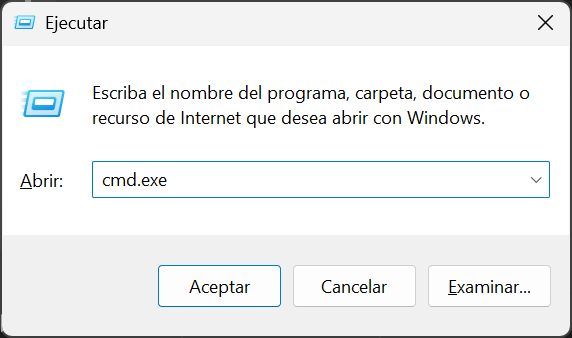
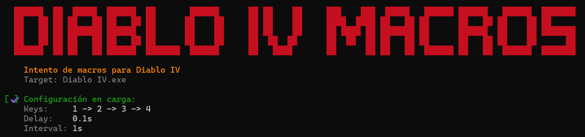
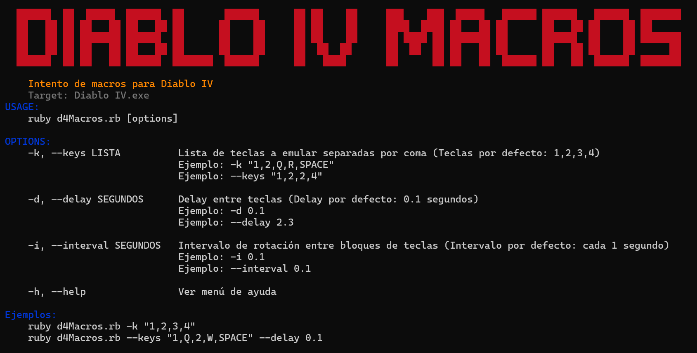
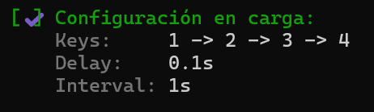
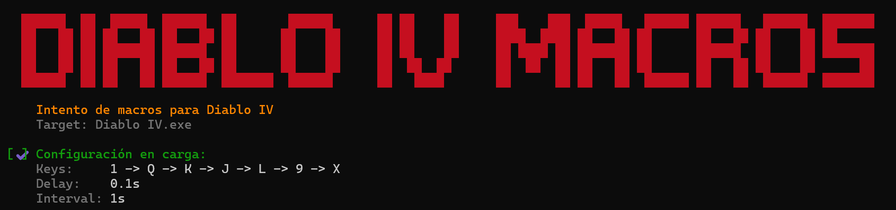
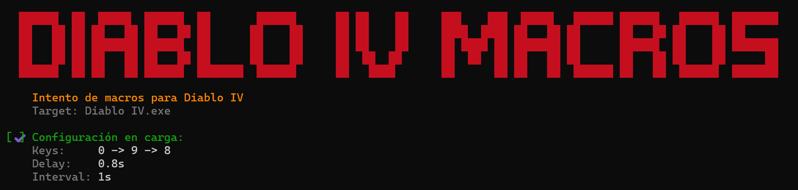
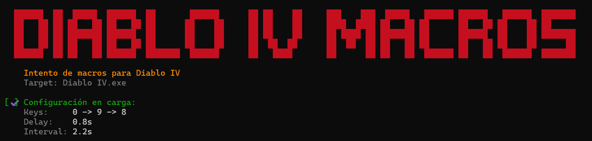
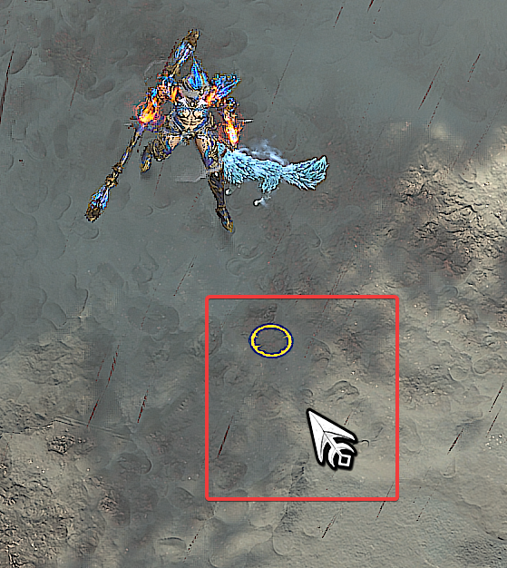

# Diablo IV Macros

<div align="center">
  
</div>

Herramienta de terminal escrita en Ruby, que permite emular comportamiento de teclado y mouse para ejecutar macros sobre juego Diablo IV.
(Por ahora compatible con Windows. Futura actualización para run de procesos ms desde entornos Linux)

---

## Instalar la herramienta de macros

- Descargar el script al directorio Descargas en Windows

```powershell
# Si el directorio de descargas se llama Download, ejecutar esto
curl.exe -o %USERPROFILE%\Downloads\d4Macros.rb https://raw.githubusercontent.com/iTroxB/My-scripts/refs/heads/main/Diablo-4-Macros/d4Macros.rb

# Si el directorio de descargas se llama Descargas, ejecutar esto
curl.exe -o %USERPROFILE%\Descargas\d4Macros.rb https://raw.githubusercontent.com/iTroxB/My-scripts/refs/heads/main/Diablo-4-Macros/d4Macros.rb
```

## Ejecutar la herramienta de macros

- Primero, tener en ejecución el Diablo IV
- El macro se puede ejecutar antes, pero mejor abrir D4 primero y luego ejecutar el macro

- Ya con D4 abierto y estando dentro de Santuario, abrir cmd presionando `Ctrl + R`, ingresar cmd.exe y luego dar a Enter

<div align="center">
  
</div>

- Desde la terminal cmd, ejecutar lo siguiente para abrir directorio de descargas

```powershell
# Si el directorio de descargas se llama Download, ejecutar esto
cd %USERPROFILE%\Downloads\

# Si el directorio de descargas se llama Descargas, ejecutar esto
cd %USERPROFILE%\Descargas\
```

- Ejecutar el script de macros desde cmd

```powershell
ruby d4Macros.rb
```

<div align="center">
  
</div>

---

## Utilizar la herramienta de macros

- Al ejecutar el parámetro `-h` o `--help` se accede al menú de ayuda

```powershell
ruby d4Macros.rb -h

# ó

ruby d4Macros.rb --help
```

<div align="center">
  
</div>

### Parámetros de uso

- Por defecto, el macro se ejecuta sobre las teclas 1, 2, 3 y 4, con un delay entre teclas de 0.1 segundo, a una tasa de repetición de 1 segundo (al terminar de ejecutar el bloque de teclas 1, 2, 3 y 4, espera 1 segundo y comienza de nuevo)

<div align="center">
  
</div>

#### Parámetro --keys

- El parámetro `-k` ó `--keys` sirve para definir una lista nueva de teclas a ejecutar desde la macro, en caso de que estas sean distintas a las por defecto. Se definen como un grupo de teclas en mayúsculas separadas por coma y entre comillas dobles

```powershell
ruby d4Macros.rb -k "Q,W,E,R"

# ó

ruby d4Macros.rb --keys "1,Q,K,J,L,9,X"
```

<div align="center">
  
</div>

- Lista de nombre de teclas para emular

| Tipo de carácter                 | Tecla física                              | Definición en parámetro --keys                                                           | Descripción                                                 | Ejemplos                                      |
| -------------------------------- | ----------------------------------------- | ---------------------------------------------------------------------------------------- | ----------------------------------------------------------- | --------------------------------------------- |
| Numéricos                        | 0-9                                       | 0<br>1<br><br>... resto de los números ...<br><br>8<br>9                                 | Ingresar el número a secas                                  | ruby d4Macros.rb --keys "1,2"                 |
| Alfabéticos                      | A-Z                                       | A<br>B<br>C<br><br>... resto del abecedario ...<br><br>X<br>Y<br>Z                       | Ingresar la letra en mayúsculas a secas                     | ruby d4Macros.rb --keys "A,P,M"               |
| Carácter especial                | ESPACIO                                   | {SPACE}                                                                                  | Ingresar el nombre en mayúsculas y entre llaves             | ruby d4Macros.rb --keys "1,A,{SPACE}"         |
| Carácter especial                | ENTER o INTRO                             | {ENTER}                                                                                  | Ingresar el nombre en mayúsculas y entre llaves<br>         | ruby d4Macros.rb --keys "1,A,{SPACE},{ENTER}" |
| Carácter especial                | ESC o ESCAPE                              | {ESC}                                                                                    | Ingresar el nombre en mayúsculas y entre llaves             | ruby d4Macros.rb --keys "{ESC}"               |
| Carácter especial                | TAB o TABULADOR                           | {TAB}                                                                                    | Ingresar el nombre en mayúsculas y entre llaves             | ruby d4Macros.rb --keys "{ESC},{TAB}"         |
| Carácter especial                | BACKSPACE o BORRADOR                      | {BS}                                                                                     | Ingresar el nombre en mayúsculas y entre llaves             | ruby d4Macros.rb --keys "A,{BS}"              |
| Carácter especial                | SHIFT                                     | {SHIFT}                                                                                  | Ingresar el nombre en mayúsculas y entre llaves             | ruby d4Macros.rb --keys "A,{BS},{SHIFT}"      |
| Caracteres simbólicos directos   | .<br>-<br>/<br>;<br>=                     | .<br>-<br>/<br>;<br>=                                                                    | Ingresar el carácter a secas                                | ruby d4Macros.rb --keys ".,-,1,="             |
| Caracteres simbólicos reservados | ,<br>+<br>^<br>%<br>~<br>(<br>)<br>{<br>} | {,}<br>{+}<br>{^}<br>,{,}"     |
| Teclas de función                | F1-F12                                    | {F1}<br>{F2}<br>{F3}<br><br>... resto de las teclas de función ...<br><br>{F11}<br>{F12} | Ingresar el nombre de la tecla en mayúsculas y entre llaves | ruby d4Macros.rb --keys "A,{BS},{F3},{F12}"   |
| Teclas de navegación             | UP o FLECHA HACIA ARRIBA                  | {UP}                                                                                     | Ingresar el nombre en mayúsculas y entre llaves             | ruby d4Macros.rb --keys "{UP},{F12}"          |
| Teclas de navegación             | DOWN o FLECHA HACIA ABAJO                 | {DOWN}                                                                                   | Ingresar el nombre en mayúsculas y entre llaves             | ruby d4Macros.rb --keys "{DOWN},{F12}"        |
| Teclas de navegación             | LEFT o FLECHA HACIA LA IZQUIERDA          | {LEFT}                                                                                   | Ingresar el nombre en mayúsculas y entre llaves             | ruby d4Macros.rb --keys "{LEFT},{F3}"         |
| Teclas de navegación             | RIGHT o FLECHA HACIA LA DERECHA           | {RIGHT}                                                                                  | Ingresar el nombre en mayúsculas y entre llaves             | ruby d4Macros.rb --keys "{RIGHT},{F1}"        |
| Teclas de navegación             | PÁGINA ARRIBA O PAGE UP                   | {PGUP}                                                                                   | Ingresar el nombre en mayúsculas y entre llaves             | ruby d4Macros.rb --keys "{PGUP},{F2}"         |
| Teclas de navegación             | PÁGINA ABAJO O PAGE DOWN                  | {PGDN}                                                                                   | Ingresar el nombre en mayúsculas y entre llaves             | ruby d4Macros.rb --keys "{PGDN},A"            |

#### Parámetro --delay

- El parámetro `-d` ó `--delay` sirve para definir el retardo entre la emulación de cada tecla. Por ejemplo, si la lista de letras a emular es "Q,W,E,R", y se define un delay de 2 segundos con `ruby d4Macros.rb --delay 2`, cuando se ejecute la emulación de la letra Q, se esperarán 2 segundos para pasar a emular la tecla W, luego 2 segundos mas para emular la tecla E y finalmente 2 segundos para emular la tecla R.
- Por defecto el macro emula con un delay de 0.1 segundos entre teclas

```powershell
ruby d4Macros.rb -d 3

# ó

ruby d4Macros.rb --delay 0.8
```

<div align="center">
  
</div>

#### Parámetro --interval
- El parámetro `-i` ó `--interval` sirve para definir el retardo de ejecución entre bloques de teclas. Por ejemplo, si la lista de letras a emular es "Q,W,E,R", y se define un intervalo de 5 segundos con `ruby d4Macros.rb --interval 5`, cuando se ejecute el programa se emulará la letra Q, luego la tecla W, luego la tecla E, luego la tecla R, y como esta es la última tecla del bloque a emular, se esperarán 5 segundos y todo comenzará de nuevo, en forma de bucle.

```powershell
ruby d4Macros.rb -i 10

# ó

ruby d4Macros.rb --interval 2.2
```

<div align="center">
  
</div>

---
## Futuras actualizaciones

1. Investigar la posibilidad de implementar una simulación matricial de movimiento, bajo algún tipo de algoritmo que permita emular el comportamiento del mouse dentro del entorno DirectInput/WinAPI, con la finalidad de que el personaje se desplace de forma automática por Santuario

2. Investigar como abordar el Pathfinding desde un script de movimiento inteligente, que analice la interacción del cliente de juego sobre el puntero, para diferenciar zonas transitables (navmesh válido), de obstáculos visuales o terreno bloqueado, evitando clics muertos en montañas o escenografía no accesible.

En la siguiente imagen se visualiza que todo el terreno entre las líneas verdes es accesible al hacer clic, pero lo rayado en rojo es solo recurso visual del mapa, no accesible por el personaje

<div align="center">
  
</div>

Al realizar un clic de movimiento sobre un terreno válido para la movilización, el juego indica la validez de esta acción por un remarcado de cursor en forma de círculo amarillo. Con esto se indica que la acción de movimiento fue correctamente interpretada, y que el personaje se movilizará al punto indicado

<div align="center">
  
</div>

Al realizar un clic de movimiento sobre un terreno no válido para movilizarse, el juego envía al personaje al punto válido más cercano, y no replica la validez de esta acción con un remarcado de cursor en forma de círculo amarillo, si no que no remarca ni destaca nada al realizar la acción de clic. Así, el personaje se movilizará al punto válido mas cercano sobre el eje coordenado hacia el cual se realizó la acción, colisionando contra la montaña y no avanzando sobre ella

<div align="center">
  
</div>

3.  Detección de objetivos sobre el comportamiento del cursor in game, con el fin de identificar cambios de estado al interactuar con diferentes entidades (terreno vacío, objetos destructibles, cofres, enemigos)

4. En caso de poder cumplir las condiciones anteriores, analizar la posible ejecución de condicional dentro de la macro que permite realizar trigger bot, refinando el motor para distinguir entre movimiento y combate. La finalidad será que la rotación de habilidades definida en el parámetro --keys se dispare únicamente al confirmar un target enemigo válido, manteniéndose en modo pasivo cuando solo se realizan clics sobre terreno transitable o elementos destruibles del mapa
