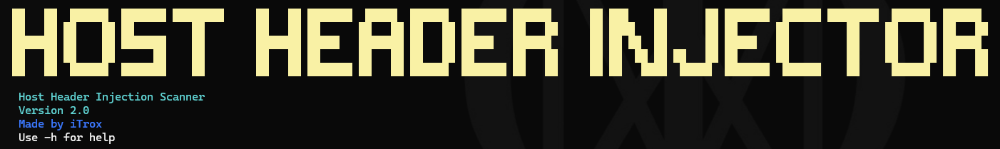
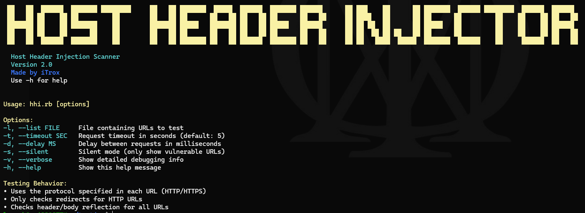
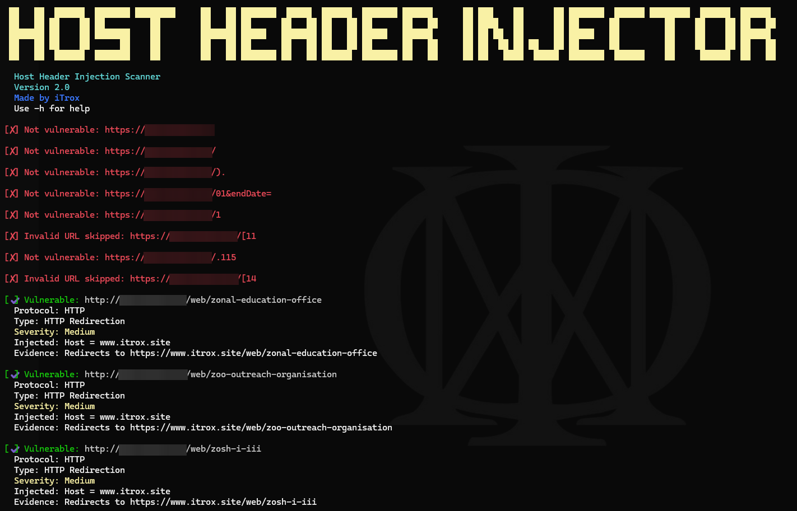

# Host-Header-Injector

<div align="center">
  
</div>

CLI tool written in Ruby that allows to perform HTTP query Host header injection tests, to analyze possible attack vectors in HTTP Host Header Injection web vulnerability.

---

## Install tool

* Download the script to your system

```shell
mkdir -p ~/iTools/Host-Header-Injector/ && cd $_
curl -O https://raw.githubusercontent.com/iTroxB/My-scripts/refs/heads/main/Host-Header-Injector/hostHeaderInjector.rb
```

* Create symbolic link to the script

```shell
sudo ln -s ~/iTools/Host-Header-Injector/hostHeaderInjector.rb /usr/bin/hostHeaderInjector
```

* To know the options and parameters of the tool run the help menu with the flag `-h`

```shell
hostHeaderInjector -h
```

<div align="center">
  
</div>

---

## Use tool

- Running a scan on a list of URLs with output file generation for vulnerable URLs

<div align="center">
  
</div>

- Running a scan on a list of URLs in SILENT MODE

<div align="center">
  
</div>
