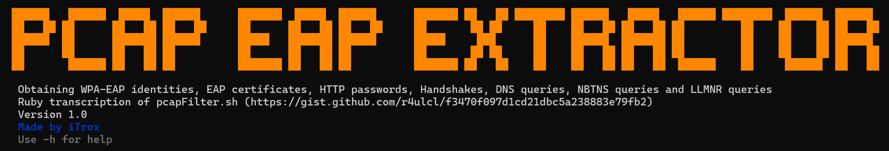
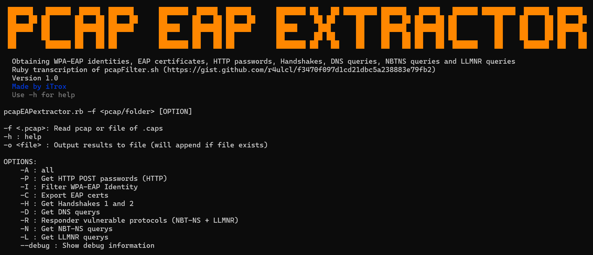
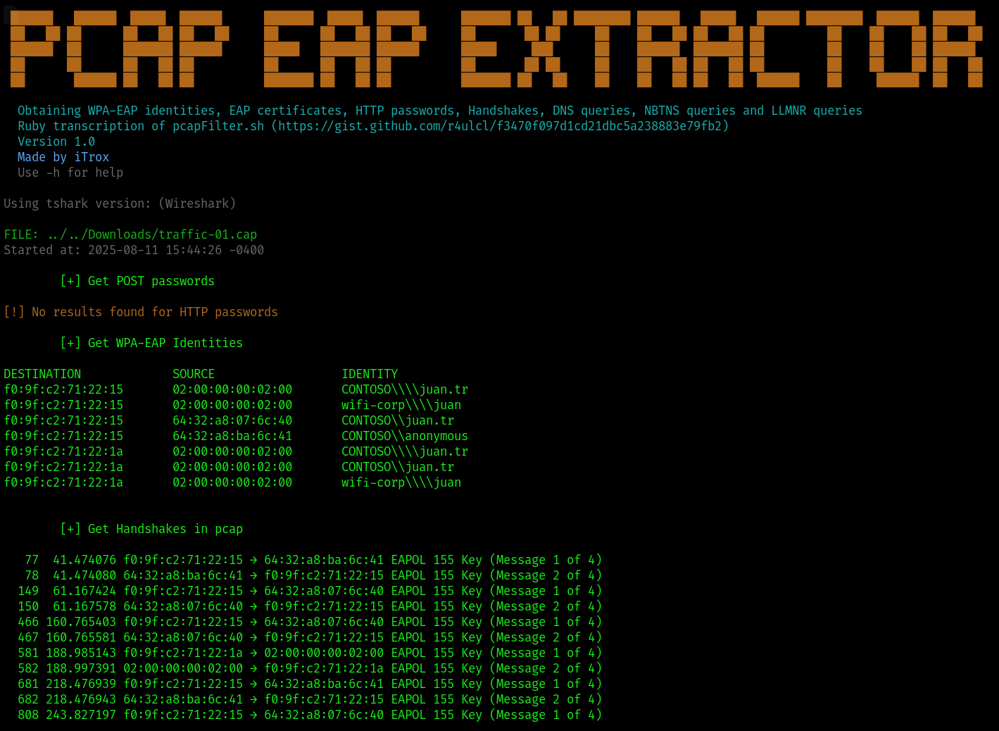
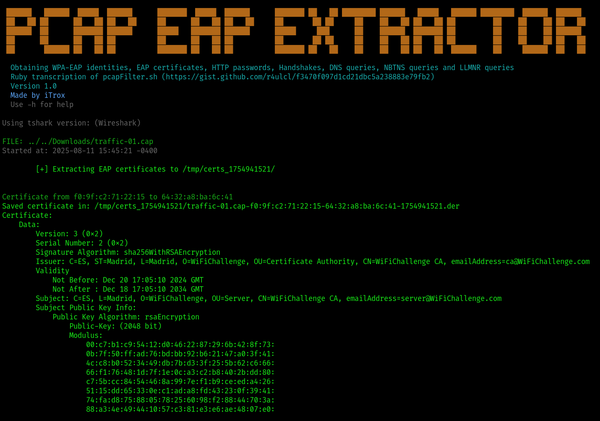

# PCAP EAP Extractor

<div align="center">
  
</div>

Obtaining WPA-EAP identities, EAP certificates, HTTP passwords, Handshakes, DNS queries, NBTNS queries and LLMNR queries

---

## Install tool

* Download the scripts to your system

```shell
mkdir -p ~/iTools/PCAP-EAP-Extractor/ && cd $_
curl -O https://raw.githubusercontent.com/iTroxB/My-scripts/refs/heads/main/PCAP-EAP-Extractor/pcapEAPextractor.rb
curl -O https://raw.githubusercontent.com/iTroxB/My-scripts/refs/heads/main/PCAP-EAP-Extractor/requirements.sh
```

* Install requirements

```shell
bash ~/iTools/PCAP-EAP-Extractor/requirements.sh
```

* Create symbolic link to the script

```shell
sudo ln -s ~/iTools/PCAP-EAP-Extractor/pcapEAPextractor.rb /usr/bin/pcapEAPextractor
```

* To know the options and parameters of the tool run the help menu with the flag `-h`

```shell
pcapEAPextractor -h
```

<div align="center">
  
</div>

---

## Use tool

- Extract information from .cap file under -A parameter

<div align="center">
  
</div>

- Extract only certificates from .cap file under -C parameter

<div align="center">
  
</div>

