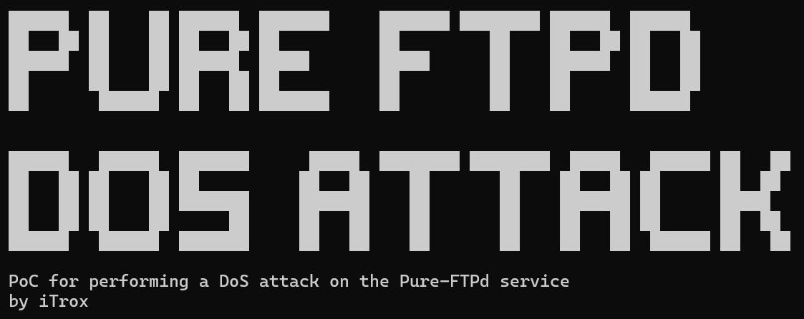
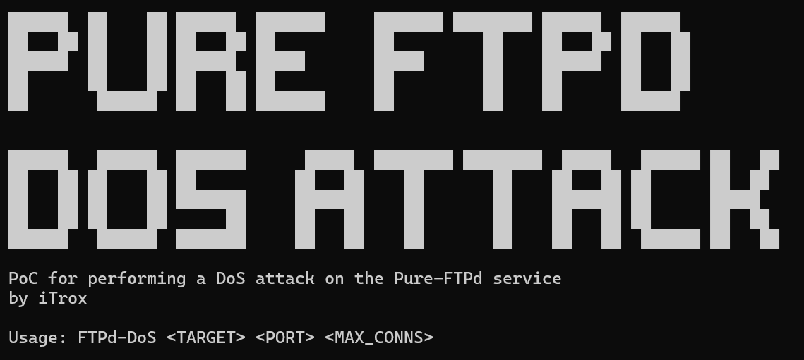
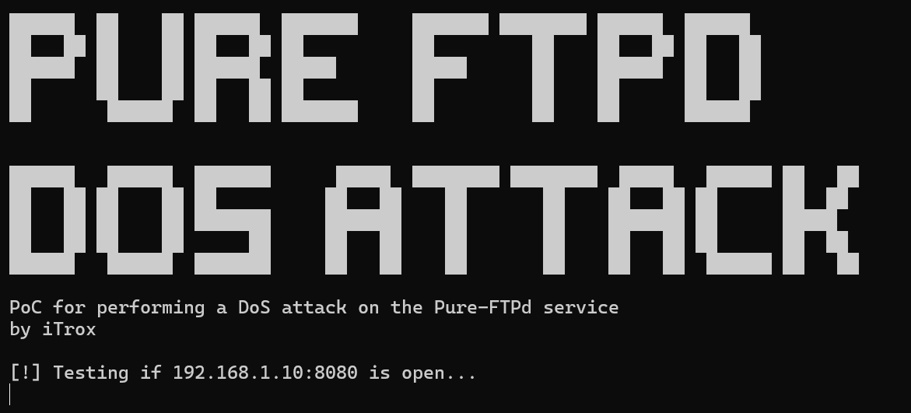

# Pure FTPd DoS attack

<div align="center">
  
</div>

Obtaining WPA-EAP identities, EAP certificates, HTTP passwords, Handshakes, DNS queries, NBTNS queries and LLMNR queries

---

## Install tool

* Download the scripts to your system

```shell
mkdir -p ~/RubyTools/Pure-FTPd-DoS/ && cd $_
curl -O https://raw.githubusercontent.com/iTroxB/My-scripts/refs/heads/main/Pure-FTPd-DoS/FTPd-DoS.go
```

* To know the options and parameters of the tool run the help menu with the flag `-h`

```shell
go run FTPd-DoS.go
```

<div align="center">
  
</div>

---

## Use tool

- go run FTPd-DoS.go 192.168.1.10 8080 5

<div align="center">
  
</div>