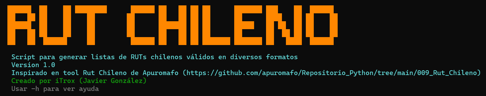
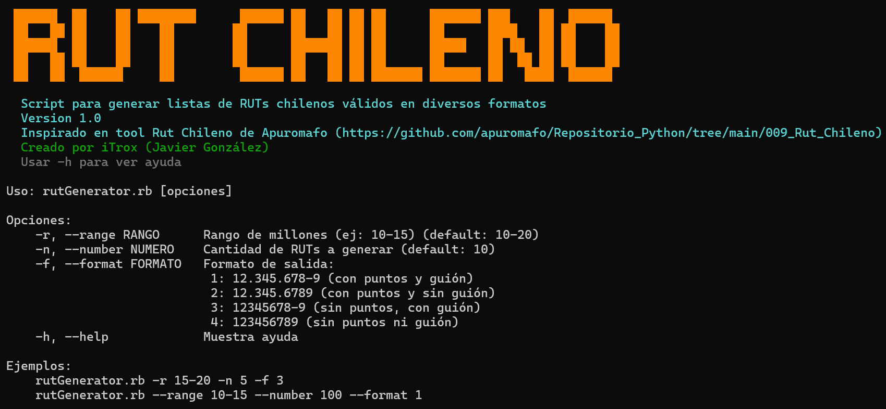
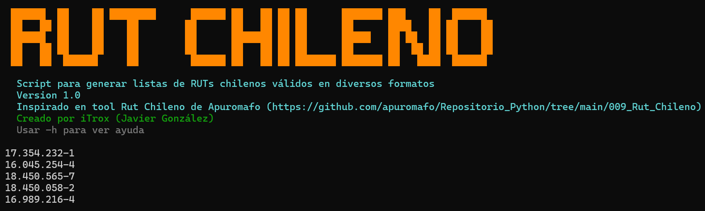
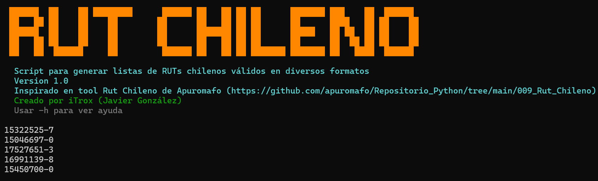

# RUT Generator

<div align="center">
  
</div>

Generador de listas de RUTs chilenos válidos en diferentes formatos.

---

## Instalar la herramienta

* Descargar el script al sistema

```shell
mkdir -p ~/iTools/RUT-Generator/ && cd $_
curl -O https://raw.githubusercontent.com/iTroxB/My-scripts/refs/heads/main/RUT-Generator/rutGenerator.rb
```

* Crear enlace simbólico al script

```shell
sudo ln -s ~/iTools/RUT-Generator/rutGenerator.rb /usr/bin/rutGenerator
```

* Para conocer las opciones y parámetros de la herramienta, ejecutarla con la opción `-h`

```shell
rutGenerator -h
```

<div align="center">
  
</div>

---

## Usar la herramienta

- Crear lista de ruts válidos en formato con puntos y guión

```shell
rutGenerator -n 5 -r 15-18 -f 1
```
<div align="center">
  
</div>

- Crear lista de ruts válidos en formato solo con guión

```shell
rutGenerator -n 5 -r 15-18 -f 3
```

<div align="center">
  

</div>
