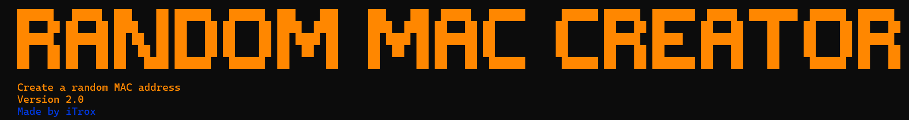
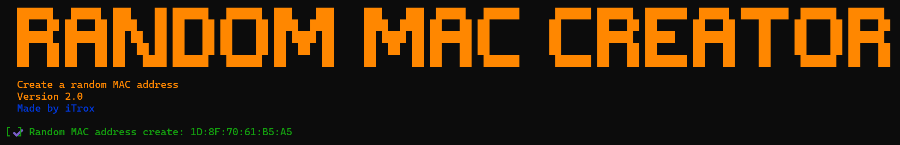

# Random MAC Creator

<div align="center">
  
</div>

Script that creates random MAC addresses by assigning real octets in the OUI (Organizationally Unique Identier) and randomizing the octets of the UAA (Universally Administered Address).

Focused on creating real random addresses that are not detected by MAC anti-spoofing techniques.
---

## Install tool

* Download the script to your system

```shell
mkdir -p ~/iTools/Random-MAC-Creator/ && cd $_
curl -O https://raw.githubusercontent.com/iTroxB/My-scripts/refs/heads/main/Random-MAC-Creator/randomMACcreator.rb
```

* Create symbolic link to the script

```shell
sudo ln -s ~/iTools/Random-MAC-Creator/randomMACcreator.rb /usr/bin/randomMACcreator
```

---

## Use tool

- Execute randomMACreator

<div align="center">
  

</div>
