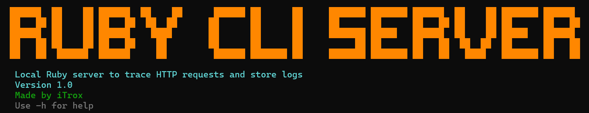
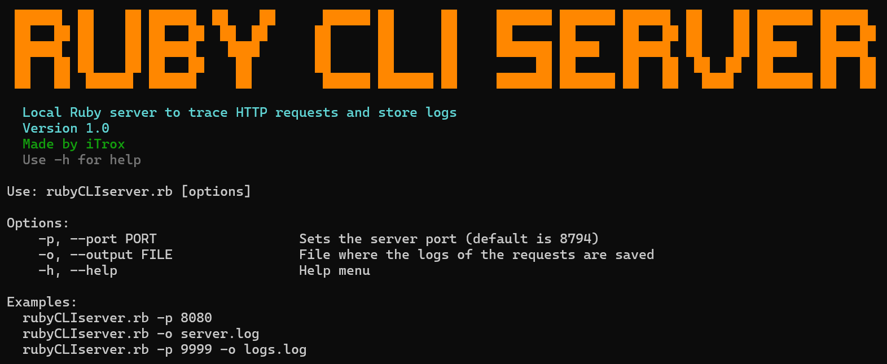
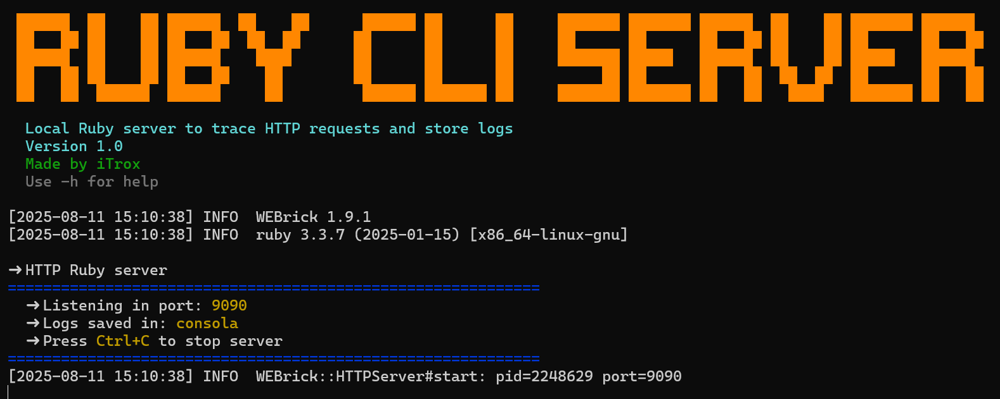
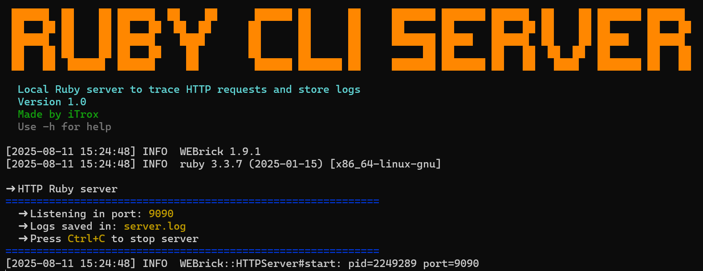

# Ruby CLI Server

<div align="center">
  
</div>

Local server written in Ruby to trace HTTP requests and store logs

---

## Install tool

* Download the script to your system

```shell
mkdir -p ~/RubyTools/Ruby-CLI-Server/ && cd $_
curl -O https://raw.githubusercontent.com/iTroxB/My-scripts/refs/heads/main/Ruby-CLI-Server/rubyCLIserver.rb
```

* Create symbolic link to the script

```shell
sudo ln -s ~/RubyTools/Ruby-CLI-Server/rubyCLIserver.rb /usr/bin/rubyCLIserver
```

* To know the options and parameters of the tool run the help menu with the flag `-h`

```shell
rubyCLIserver -h
```

<div align="center">
  
</div>

---

## Use tool

- Execute server on port 9090

<div align="center">
  
</div>

- Running server on port 9090 with output file

<div align="center">
  
</div>