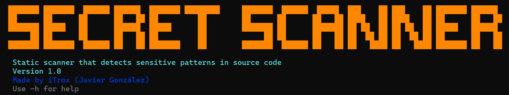
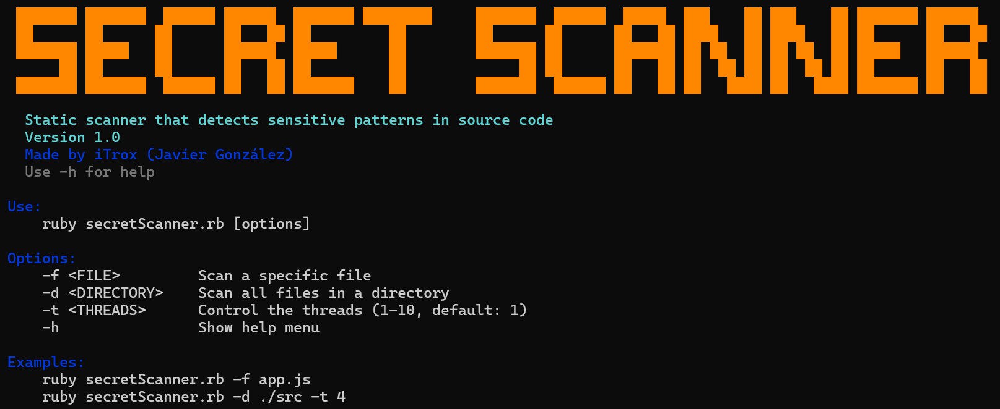
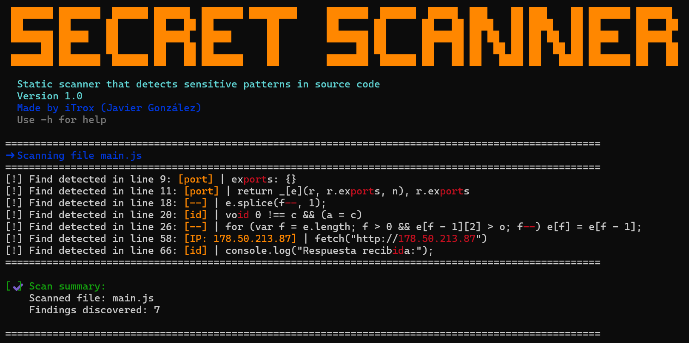
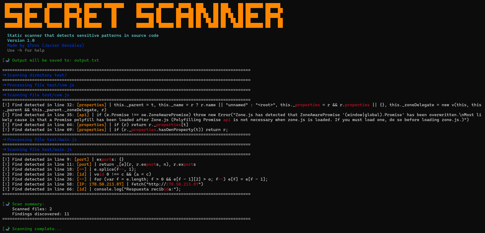

# Secret Scanner

<div align="center">
  
</div>

Complementary static scanner that detects sensitive strings in source code. Since it detects strings associated with a list, it is necessary to always review all findings to debug false positives.

>[!info]
>The scanner detects strings associated with a list, so it is always necessary to review all findings to filter out false positives.

---

## Install tool

* Download the scripts to your system

```shell
mkdir -p ~/iTools/Secret-Scanner/ && cd $_
curl -O https://raw.githubusercontent.com/iTroxB/My-scripts/refs/heads/main/Secret-Scanner/secretScanner.rb
```

* Create symbolic link to the script

```shell
sudo ln -s ~/iTools/Secret-Scanner/secretScanner.rb /usr/bin/secretScanner
```

* To know the options and parameters of the tool run the help menu with the flag `-h`

```shell
secretScanner -h
```

<div align="center">
  
</div>

---

## Use tool

- Scan file

```shell
secretScanner -f main.js
```

<div align="center">
  
</div>

- Scan files within a directory with 5 threads and output file generation

```shell
secretScanner -d test/ -t 5 -o output.txt
```

<div align="center">
  
</div>